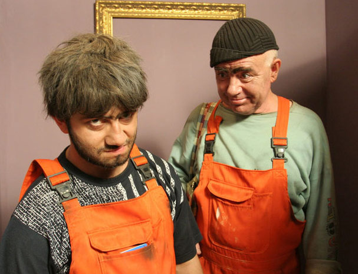
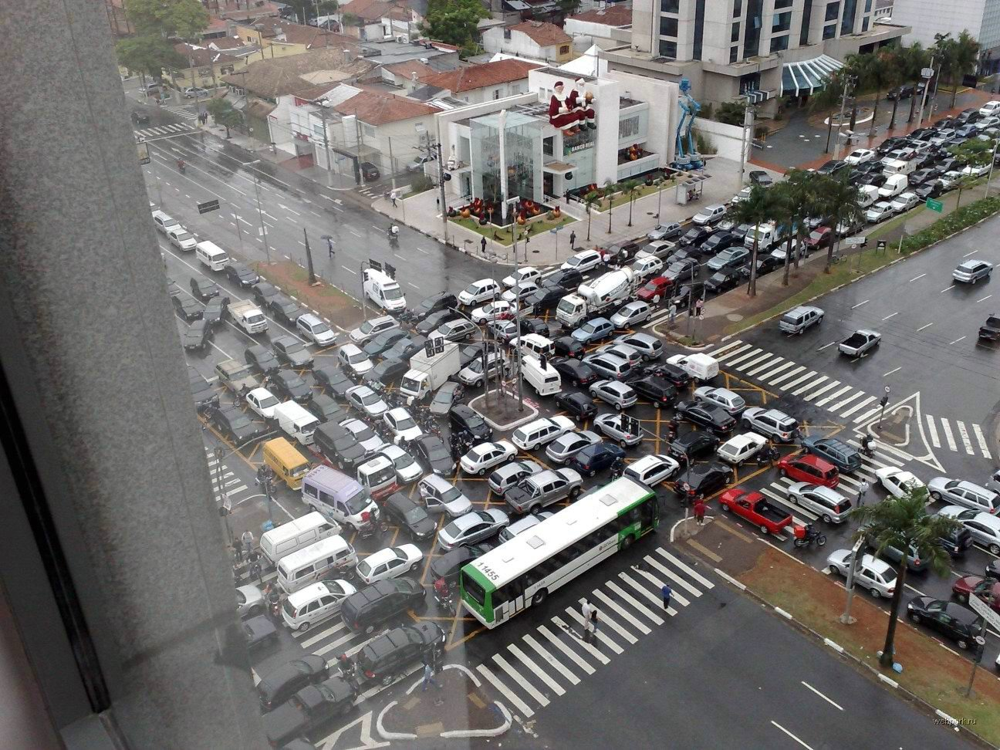
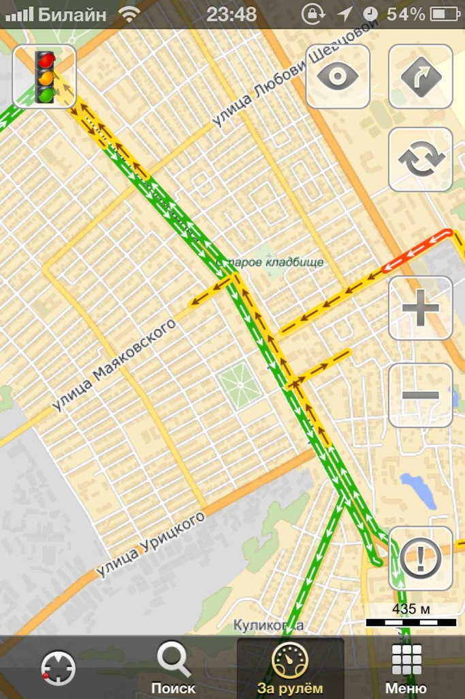
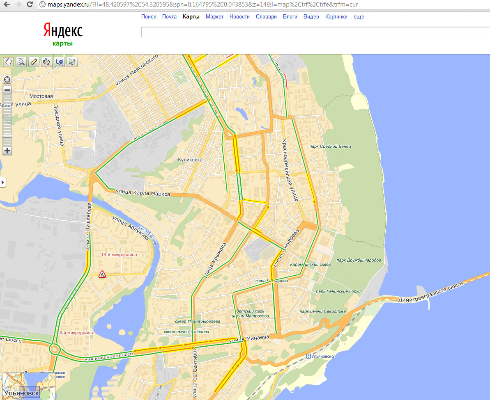
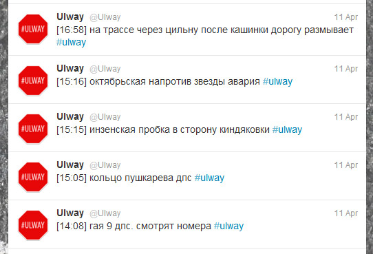
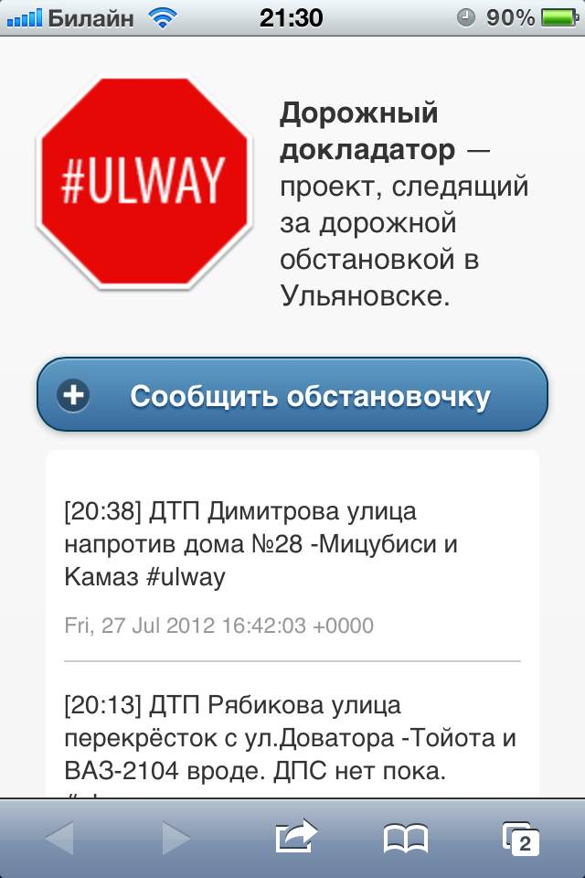
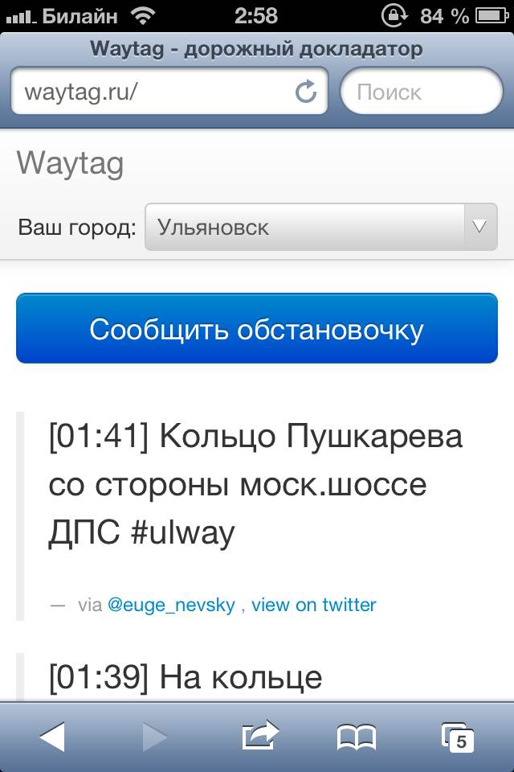
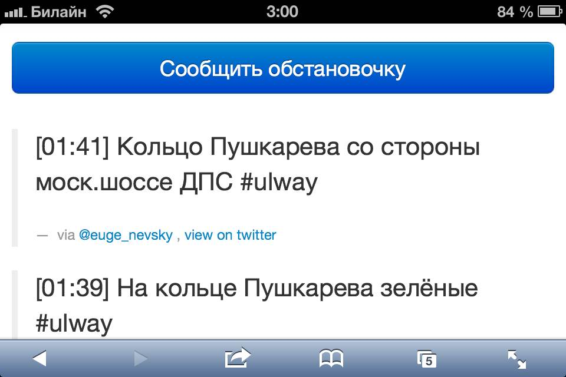

# dorojnie-docladatory0

!SLIDE

# Дорожные докладаторы

## От @Ulway до Waytag.ru

!SLIDE

# Две проблемы

1. С первой ничего сделать нельзя
2. Иметь актуальную информацию о состоянии второй можно

!SLIDE

!SLIDE

!SLIDE

!SLIDE

!SLIDE

!SLIDE

# Яндекс.пробки
декабрь 2011  
## Источник
мобильное приложение Яндекс.Карты
## Экспорт
Автоспутник, NAVIFON, Be-On-Road, Garmin-ASUS, SHTURMANN

!SLIDE

!SLIDE

<table>
	<tr>
		<td>
			
		</td>
		<td>
			
		</td>
		<td>
			
		</td>
	</tr>
</table>

!SLIDE

!SLIDE

# Яндекс.Навигатор

!SLIDE

# Рамблер.пробки
осень 2011
## Источник
навигационная система ПроГород  
мобильное приложение Rambler.карты

!SLIDE

!SLIDE

!SLIDE

# Навител.пробки
весна 2010

!SLIDE

# ICQ-Бот
## Анти-ГАИ Ульяновск
### Весна 2010
* 11920 пользователей
* 20000 запросов в сутки  

!SLIDE

!SLIDE

# #ulway

!SLIDE

# 20 сентября 2011
## @Ulway

Дима Вислов (идея)  
Костя Соколов (дизайн)  
Саша Щербинин (программирование)

Юра Токарёв (программирование)  
Лёша Загайчук (программирование)

!SLIDE

!SLIDE

# Февраль 2012
Андрей Кулаков (backend-ninja)  
## SILEX

!SLIDE

!SLIDE
* более сложная фильтрация с учётам смысловой нагрузки;
* сайт проекта с возможностью отправить сообщение с него;
* чтение сообщений из реплаев твиттера;
* рефакторинг бекенд части.

!SLIDE
# ulway.net

## конференция СТАЧКА
Front-End :: jQuery Mobile

!SLIDE

<table>
	<tr>
		<td>
			
		</td>
		<td>
			
		</td>
		<td>
			
		</td>
	</tr>
</table>

!SLIDE

# апрель 2012
### **305** followers
# январь 2013
### **763** followers

!SLIDE

# 14 ноября 2012
## Лампочка Ильича
### Первое место  "Лучшая группа в соцсетях"

!SLIDE

!SLIDE

# 15-16 декабря 2012
## RAILSCLUB

!SLIDE

# Waytag
### Front-End :: Twitter Bootstrap

!SLIDE

<table>
	<tr>
		<td>
			
		</td>
		<td>
			
		</td>
	</tr>
</table>

!SLIDE

!SLIDE

!SLIDE

!SLIDE

!SLIDE

!SLIDE

# Чебоксары
## @Chebway
## #chebway

!SLIDE

# 4 января 2013
## Эфир на ChebFM

!SLIDE

# 9 января 2013
## Waytag.ru

!SLIDE

# OFFLINE
## наклейки на авто
## майки лучшим постерам

!SLIDE

# Планы
* фирменный стиль
* блог
* дружба с ICQ
* захват Мира >:(