# dorojnie-docladatory0

!SLIDE

# Дорожные докладаторы

## От @Ulway до Waytag.ru

!SLIDE

# Две проблемы

1. С первой ничего сделать нельзя
2. Иметь актуальную информацию о состоянии второй можно

!SLIDE


!SLIDE


!SLIDE


!SLIDE


!SLIDE


!SLIDE

# Яндекс.пробки
декабрь 2011  
## Источник
мобильное приложение Яндекс.Карты

!SLIDE

## Экспорт
Автоспутник, NAVIFON, Be-On-Road, Garmin-ASUS, SHTURMANN

!SLIDE

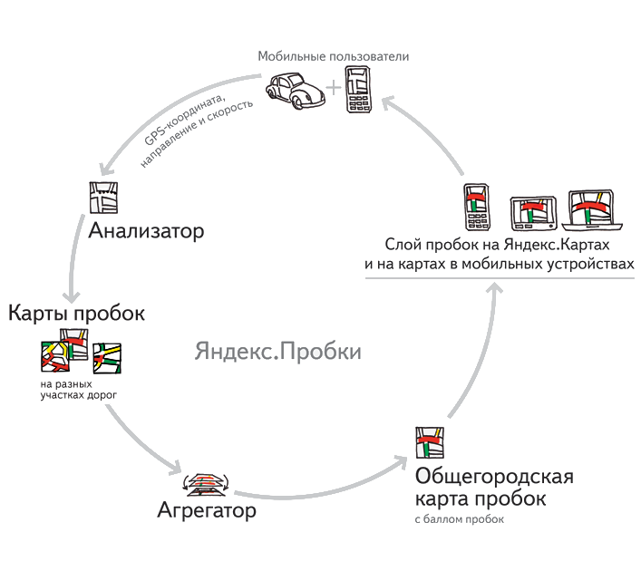

!SLIDE

<table>
	<tr>
		<td>
			
		</td>
		<td>
			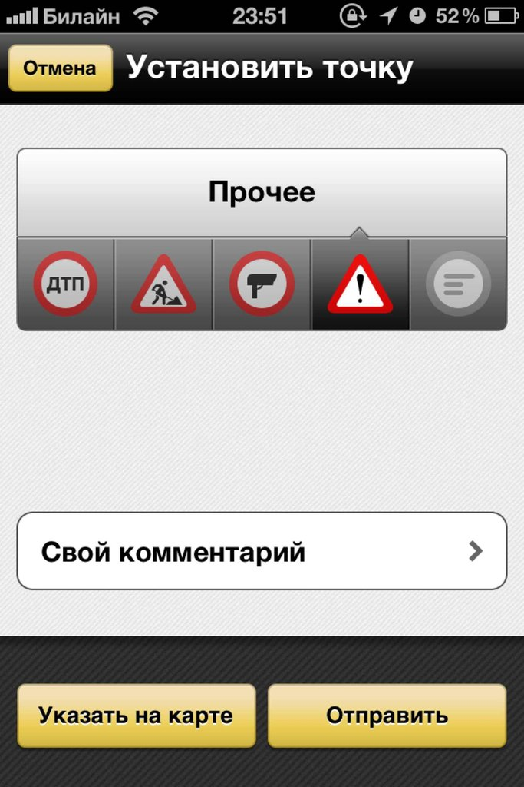
		</td>
		<td>
			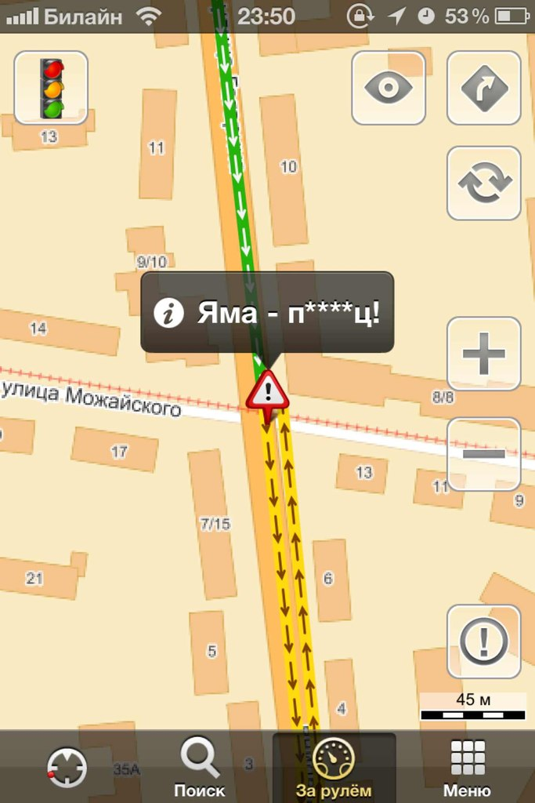
		</td>
	</tr>
</table>

!SLIDE


!SLIDE

# Яндекс.Навигатор


!SLIDE

# Рамблер.пробки
осень 2011
## Источник
навигационная система ПроГород  
мобильное приложение Rambler.карты

!SLIDE

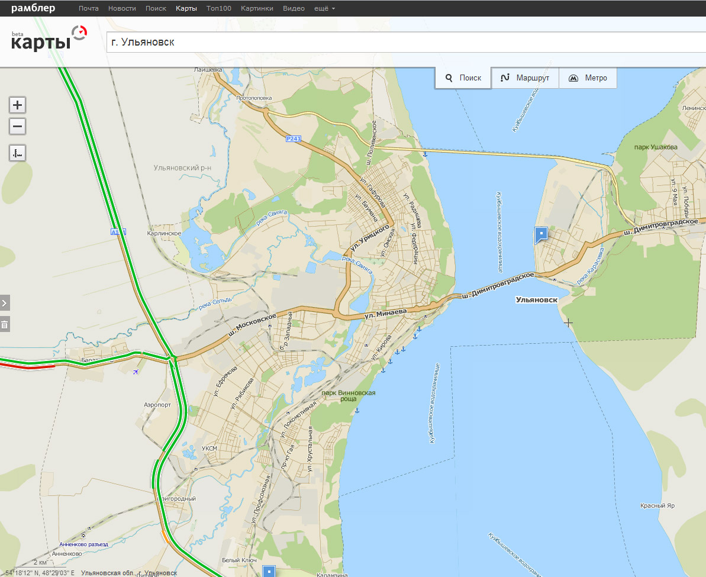

!SLIDE


!SLIDE

# Навител.пробки
весна 2010


!SLIDE

# ICQ-Бот
## Анти-ГАИ Ульяновск


!SLIDE

### Весна 2010
* 11920 пользователей
* 20000 запросов в сутки  

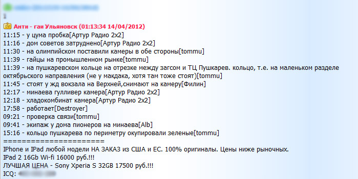

!SLIDE


!SLIDE

# #ulway


!SLIDE

# 20 сентября 2011
## @Ulway

Дима Вислов (идея)  
Костя Соколов (дизайн)  
Саша Щербинин (программирование)

Юра Токарёв (программирование)  
Лёша Загайчук (программирование)

!SLIDE

## Фичи

* Чтение сообщений из ICQ каждые 10 минут и репост сообщений в Twitter

!SLIDE

## Бэкенд

* PHP скрипт из 170 строчек кода 
* Twitter REST API
* Web ICQ Lite

!SLIDE

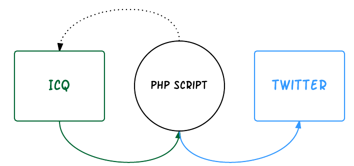

!SLIDE


!SLIDE

# Февраль 2012	

## ulway.net

Дима Вислов (fronted-jedi)  
Андрей Кулаков (backend-ninja)  

!SLIDE

## Фичи

* Чтение сообщений из ICQ и хештега #ulway
* Репост прочитанного в Twitter
* Сайт ulway.net и возможность отправки сообщения через него
* Список улиц для сайта

!SLIDE

## Бэкенд

* Silex
* Simfony::Console
* Mysql
* cron
* Twitter REST API
* mICQ

!SLIDE


!SLIDE

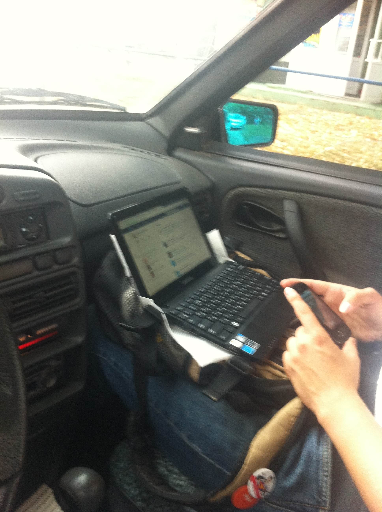

!SLIDE

## Фронтенд

* jQuery-Mobile
* Twig

!SLIDE

<table>
	<tr>
		<td>
			
		</td>
		<td>
			
		</td>
		<td>
			
		</td>
	</tr>
</table>

!SLIDE

# 14 ноября 2012
## Лампочка Ильича
### Первое место  "Лучшая группа в соцсетях"

!SLIDE


!SLIDE

# 15-16 декабря 2012
## RAILSCLUB

!SLIDE

# Waytag

!SLIDE

## Фичи

* Сайт waytag.ru и возможность отправки сообщения через него
* Поддержка множества городов
* Получение любых сообщений из твиттера по динамическим критериям
* Репост в автоматическом и ручном режиме в Twitter
* Няшная админка

!SLIDE

## Бэкенд

* RoR
* Twitter Streaming API +  REST API
* Runit daemons
* Postgres
* Clodo Scale Server, NewRelic

!SLIDE

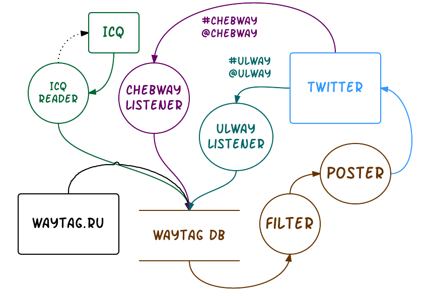

!SLIDE

## Фронтенд

* Twitter Bootstrap
* CoffeScript
* HAML
* LESS, SCSS

!SLIDE

<table>
	<tr>
		<td>
			
		</td>
		<td>
			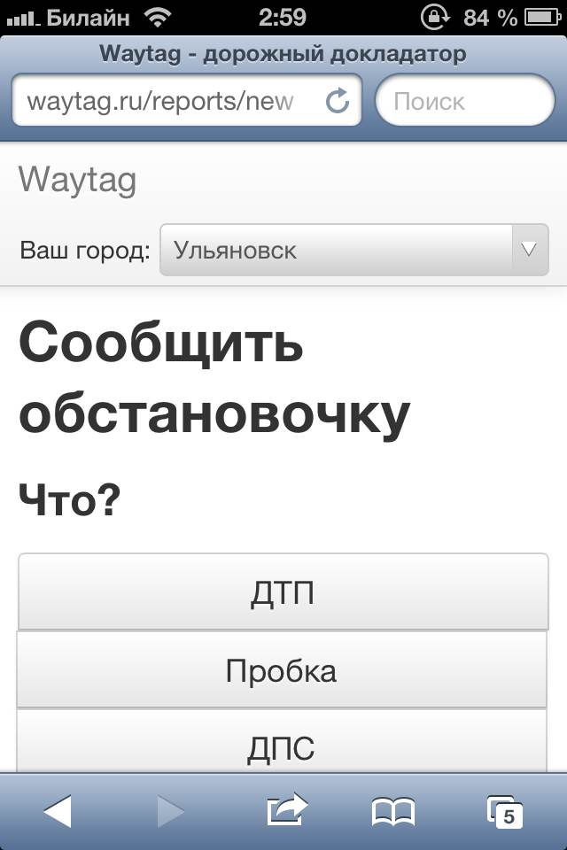
		</td>
	</tr>
</table>

!SLIDE

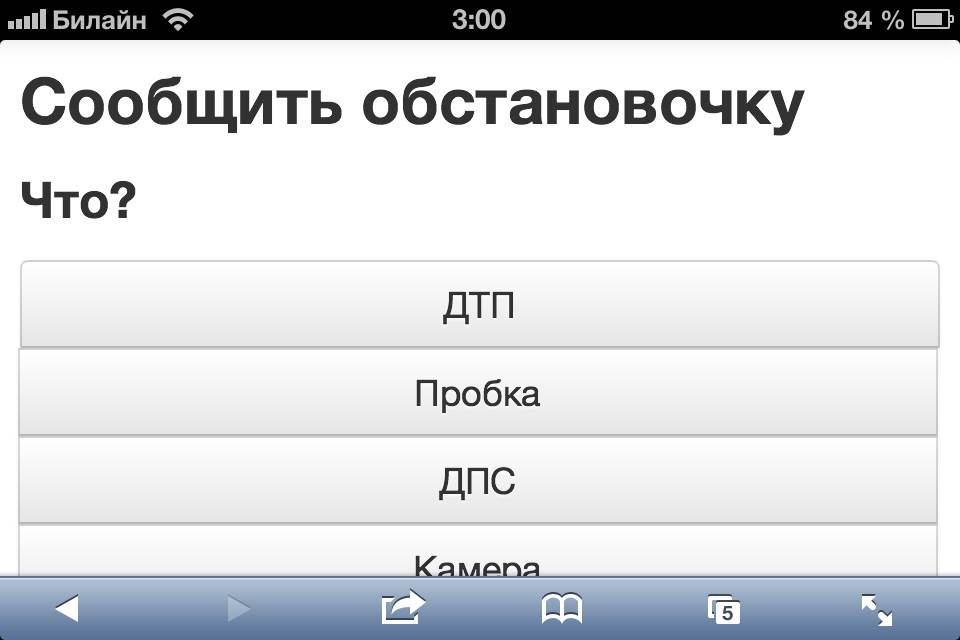


!SLIDE


!SLIDE


!SLIDE


!SLIDE


!SLIDE


!SLIDE

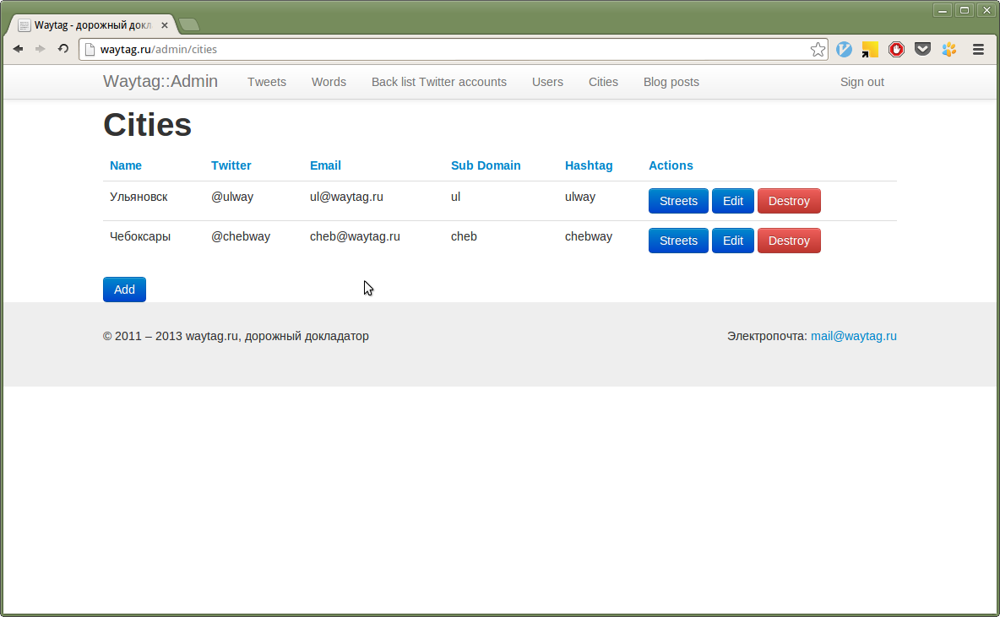

!SLIDE

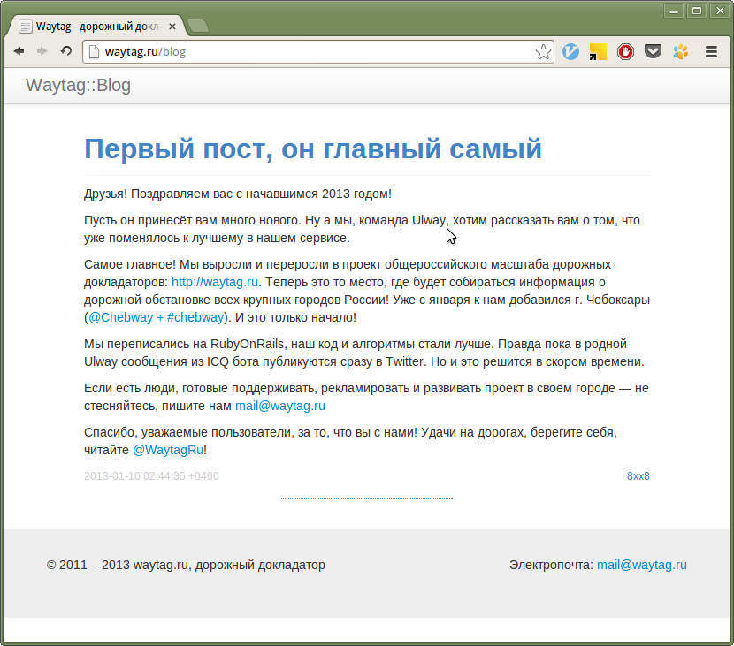

!SLIDE

# Чебоксары
## @Chebway
## #chebway

!SLIDE

# 4 января 2013
## Эфир на ChebFM

!SLIDE


!SLIDE

# 9 января 2013
## Waytag.ru

!SLIDE

# OFFLINE

!SLIDE


!SLIDE

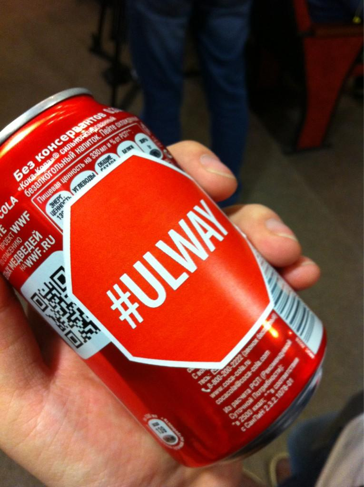

!SLIDE


!SLIDE

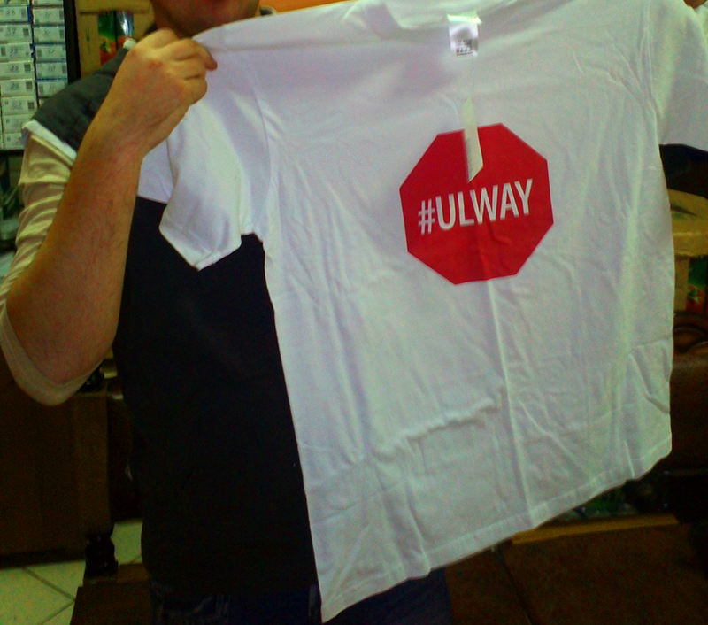

!SLIDE

# Будущее

* Фирменный стиль Waytag.ru
* Повышение качества фильтрации
* Научить сервис отвечать на вопросы
* Поиск новых источников информации
* захват Мира >:(

!SLIDE

# Статистика

* 764 Фоловера у аккаунта **@ulway**
* От 15 до 30 сообщений в сутки

* Было потрачено: ~7000р
* Было заработано: iPad 2 (одна штука) ~14000р

пока в плюсе =)

!SLIDE

# Дмитрий Вислов
* @vdv73rus

# Кулаков Андрей
* @8xx8

P.S. Попробуйте отправить в твиттер сообщение:

```
I love @Ulway!
```